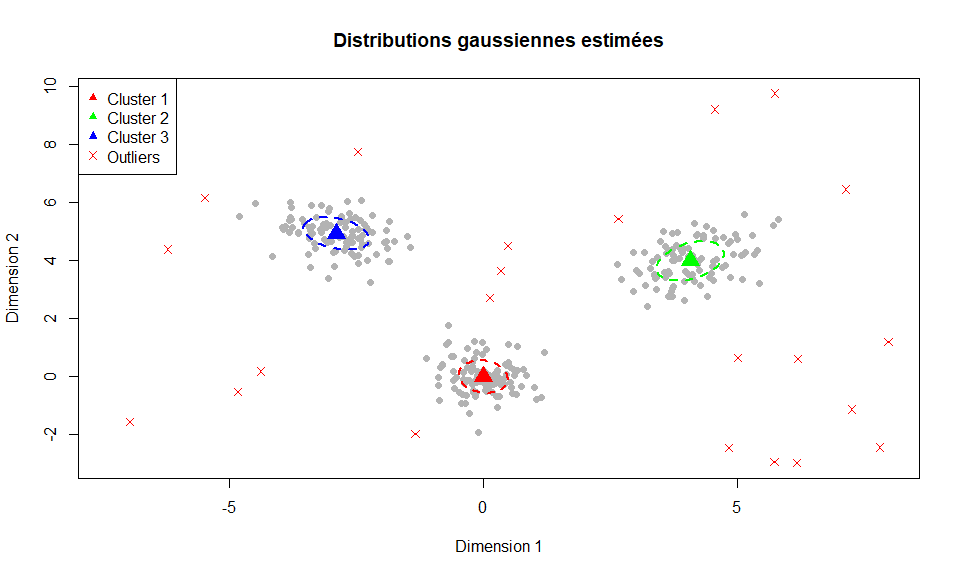
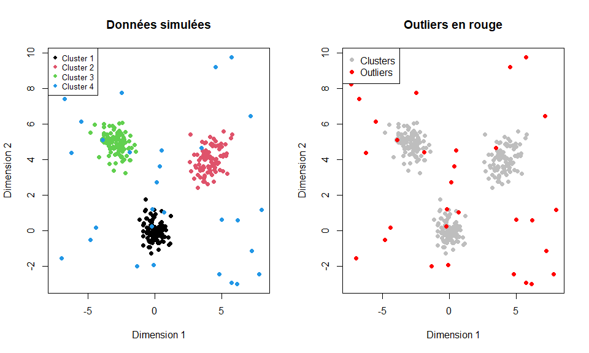
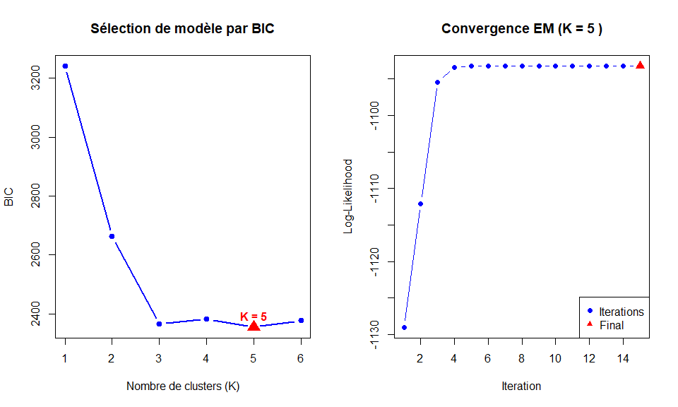
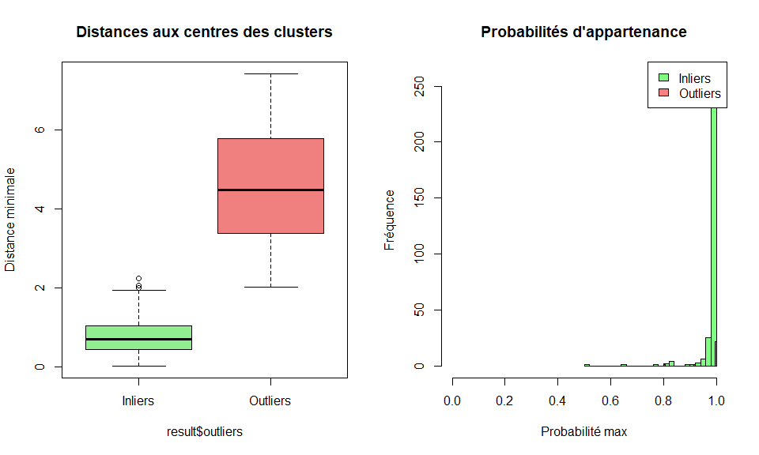
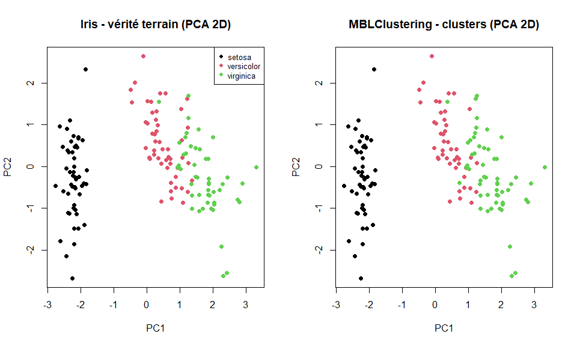

# MBLClustering — Gaussian Mixture Models with Outlier Detection

> **An R package implementing simultaneous clustering and outlier detection via Gaussian Mixture Models (GMM) with a uniform noise component, fitted by the EM algorithm and selected by BIC.**

<p align="center">
  
</p>

---

## Table of Contents

- [Overview](#overview)
- [Algorithm](#algorithm)
- [Installation](#installation)
- [Quick Start](#quick-start)
- [Main Function — `gmm_outliers()`](#main-function--gmm_outliers)
- [Output Object](#output-object)
- [Additional Functions](#additional-functions)
- [Use Cases](#use-cases)
- [Package Structure](#package-structure)
- [Vignette](#vignette)
- [Authors](#authors)

---

## Overview

`MBLClustering` provides a unified framework for **clustering** and **outlier detection** in multivariate data. Instead of treating anomaly detection as a separate post-processing step, the package integrates a **uniform noise component** directly into the mixture model — observations poorly explained by any Gaussian cluster are naturally attributed to this component and flagged as outliers.

Model selection is fully automatic: the package fits both a *K*-component Gaussian model and a *(K + 1)*-component model (K Gaussians + 1 uniform), and returns the one preferred by **BIC**.

**Key features:**

| Feature | Description |
|---------|-------------|
| **Simultaneous clustering + outlier detection** | No need for a separate outlier removal step |
| **Automatic model selection** | BIC comparison of models with and without uniform component |
| **Robustness** | Multiple random initializations to avoid local optima |
| **Soft assignments** | Returns full membership probabilities (responsibilities) |
| **Flexible dimensionality** | Works on data of any dimension |
| **Integrated visualization** | S3 `plot()` method for convergence and cluster plots |

---

## Algorithm

The model is a mixture of *K* multivariate Gaussian components and 1 uniform component:

```
p(x) = π₀ · U(x | Ω) + Σₖ πₖ · N(x | μₖ, Σₖ)
```

where `U(x | Ω)` is the uniform density over the data bounding box Ω, serving as a non-parametric noise model.

**Inference is performed by the EM algorithm:**

1. **E-step** — Compute responsibilities (posterior membership probabilities) for each observation
2. **M-step** — Update means `μₖ`, covariance matrices `Σₖ`, and mixing weights `πₖ`
3. **Repeat** until log-likelihood convergence

**Model selection** compares the Gaussian-only model (K components) with the augmented model (K Gaussians + 1 uniform) using **BIC** — lower BIC wins.

Multiple random initializations are run internally; only the solution with the highest log-likelihood is kept.

---

## Installation

```r
# Install from source (.tar.gz)
install.packages("MBLClustering_1.0.0.tar.gz", repos = NULL, type = "source")
```

**Dependencies:** `mvtnorm`, `stats`, `graphics`

---

## Quick Start

```r
library(MBLClustering)
library(mvtnorm)

set.seed(123)

# Simulate 3 Gaussian clusters + 30 outliers
cluster1 <- rmvnorm(100, mean = c(0, 0),  sigma = diag(2) * 0.3)
cluster2 <- rmvnorm(100, mean = c(4, 4),  sigma = matrix(c(0.5, 0.2, 0.2, 0.5), 2, 2))
cluster3 <- rmvnorm(100, mean = c(-3, 5), sigma = matrix(c(0.4, -0.1, -0.1, 0.4), 2, 2))
outliers  <- cbind(runif(30, -8, 8), runif(30, -3, 10))

data <- rbind(cluster1, cluster2, cluster3, outliers)
```

The simulated dataset (left: ground truth labels, right: outliers highlighted in red):

<p align="center">
  
</p>

```r
# Fit the model
result <- gmm_outliers(data, K = 3, n_init = 20, max_iter = 200)

cat("Uniform component selected:", result$has_uniform, "\n")
cat("Outliers detected:", sum(result$outliers), "\n")
cat("BIC:", round(result$BIC, 2), "\n")
```

---

## Main Function — `gmm_outliers()`

```r
gmm_outliers(data, K, n_init = 20, max_iter = 200, tol = 1e-6)
```

| Argument | Type | Description |
|----------|------|-------------|
| `data` | `matrix` / `data.frame` | Multivariate input data (n × d) |
| `K` | `integer` | Number of Gaussian components |
| `n_init` | `integer` | Number of random initializations (default: 20) |
| `max_iter` | `integer` | Maximum EM iterations per initialization (default: 200) |
| `tol` | `numeric` | Log-likelihood convergence threshold (default: 1e-6) |

---

## Output Object

`gmm_outliers()` returns a named list with the following fields:

| Field | Type | Description |
|-------|------|-------------|
| `has_uniform` | `logical` | `TRUE` if the model with uniform component was selected |
| `outliers` | `logical vector` | `TRUE` for observations flagged as outliers (MAP to uniform) |
| `responsibilities` | `matrix` (n × K+1 or n × K) | Posterior membership probabilities |
| `map_assignments` | `integer vector` | Hard cluster assignment (MAP rule) |
| `log_likelihood_trace` | `numeric vector` | Log-likelihood at each EM iteration |
| `BIC` | `numeric` | BIC value of the selected model |
| `parameters` | `list` | Estimated model parameters: `mu`, `sigma`, `pi` |
| `K` | `integer` | Number of Gaussian components |
| `n_iter` | `integer` | Total number of EM iterations |

---

## Additional Functions

### `compare_models()`

Fits `gmm_outliers()` across a range of K values and returns a comparison table sorted by BIC. The BIC curve (left) identifies the optimal K, while the EM convergence plot (right) confirms the algorithm stability:

<p align="center">
  
</p>

```r
model_comparison <- compare_models(data, K_range = 1:6, criterion = "BIC")
plot(model_comparison)
```

### `plot_diagnostics()`

Generates a multi-panel diagnostic plot for a fitted model (convergence, cluster map, responsibility heatmap).

```r
plot_diagnostics(result, type = "advanced")
```

### `calculate_metrics()`

Computes clustering performance metrics when ground truth labels are available (accuracy, ARI, purity).

```r
metrics <- calculate_metrics(result, true_labels = true_labels)
print(metrics)
```

---

## Use Cases

### Estimated Gaussian distributions

The package overlays the estimated covariance ellipses on the data, with cluster centres (triangles) and outliers (red crosses) clearly distinguished:

<p align="center">
  
</p>

### Outlier characterization

Detected outliers are significantly farther from cluster centres (left boxplot) and present distinct low membership probabilities compared to regular observations (right histogram):

<p align="center">
  
</p>

### Real data — `iris` dataset

Applied to the 4-dimensional `iris` dataset (standardized, visualized via PCA). The package recovers the three species almost perfectly with no prior label information:

<p align="center">
  
</p>

### Recommended workflow

```r
# Step 1 — Select K by BIC sweep
comparison <- compare_models(data, K_range = 2:8)
best_K     <- attr(comparison, "best_K")

# Step 2 — Fit optimal model
model <- gmm_outliers(data, K = best_K, n_init = 20)

# Step 3 — Diagnose
plot_diagnostics(model)

# Step 4 — Evaluate (if ground truth is available)
metrics <- calculate_metrics(model, true_labels = true_labels)
```

---

## Package Structure

```
MBLClustering/
├── R/
│   ├── gmm_outliers.R        # Main EM fitting function
│   ├── compare_models.R      # BIC-based model selection sweep
│   ├── plot_diagnostics.R    # Advanced diagnostic plots
│   └── calculate_metrics.R  # Clustering evaluation metrics
├── vignettes/
│   └── MBL-clustering-vignette.Rmd   # Full illustrated vignette
├── figures/                  # README figures (extracted from vignette)
├── man/                      # Roxygen2-generated documentation
├── DESCRIPTION
├── NAMESPACE
└── README.md
```

---

## Vignette

A complete illustrated vignette is included in the package, covering:

- Simulated 2D data with 3 clusters + outliers
- Responsibility analysis and uncertainty quantification
- BIC-based selection of the number of clusters
- Outlier characterization (distances, membership probabilities)
- 3D data and imbalanced cluster scenarios
- Real data: `iris` dataset with PCA visualization and contamination experiment

```r
vignette("MBL-clustering-vignette", package = "MBLClustering")
```

---

## Authors

**Maram NASR** & **Skander HAJ MABROUK**
M2 MALIA — Université Lumière Lyon 2
Model-Based Learning Module
Academic Year 2025–2026
